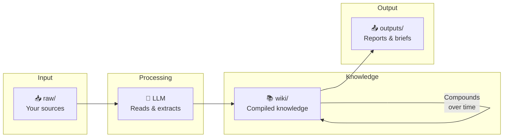
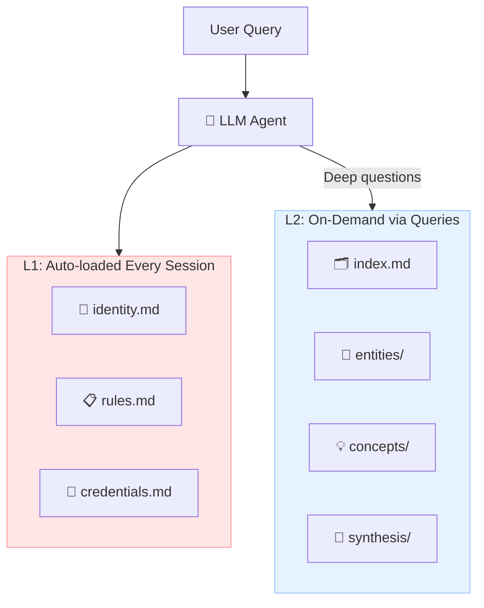

<div align="center">

# 🧠 Memex

[](https://opensource.org/licenses/MIT)
[](https://github.com/JPeetz/MeMex-Zero-RAG)
[](https://github.com/JPeetz/MeMex-Zero-RAG)
[](http://makeapullrequest.com)

**The Memex is finally buildable.**

*A zero-RAG, zero-infrastructure personal knowledge base maintained by your LLM.*

[Getting Started](#quick-start) • [Documentation](GUIDE.md) • [Prompts](PROMPTS.md) • [MCP Server](mcp/) • [Examples](examples/)

</div>

---

> *"The human's job is to curate sources, direct the analysis, ask good questions, and think about what it all means. The LLM's job is everything else."*
> — Andrej Karpathy

Based on [Karpathy's LLM Wiki pattern](https://gist.github.com/karpathy/442a6bf555914893e9891c11519de94f), extended with strict anti-hallucination protocols and human-in-the-loop conflict resolution.

## Why Zero-RAG?

Traditional RAG (Retrieval Augmented Generation) retrieves document chunks every time you ask a question. The LLM rediscovers knowledge from scratch. Every. Single. Time. Nothing compounds.

**Memex is different.** Your LLM **compiles** your sources into a structured, interlinked wiki. The knowledge is built once and kept current—not re-derived on every query.



**Every source you add makes the wiki richer. Every question you ask can be filed back. Knowledge compounds instead of resetting.**

## Key Principles

| Principle | What it means |
|-----------|---------------|
| **LLM-agnostic** | Works with Claude, GPT, Gemini, Llama, or any agent that can read/write files |
| **Zero infrastructure** | No databases, no embeddings, no servers. Just markdown files and git |
| **Git-native** | Full version history, branching, rollback. Your wiki is a repo |
| **Zero hallucination** | Every claim must cite its source. Unsourced claims are errors, not warnings |
| **Human-in-the-loop** | Conflicts are flagged and wait for YOUR decision. The LLM never decides truth |

## Quick Start

### 1. Clone and customize

```bash
git clone https://github.com/JPeetz/MeMex-Zero-RAG.git my-wiki
cd my-wiki

# Edit SCHEMA.md to describe your domain
# Edit L1/identity.md with your preferences (git-ignored, stays private)
```

### 2. Add your first source

Drop a document into `raw/`:
```bash
cp ~/Downloads/interesting-article.md raw/
```

### 3. Tell your LLM to ingest it

Open your AI agent (Claude Code, Cursor, Codex, OpenClaw, etc.) and paste:

```
Read SCHEMA.md. Then ingest raw/interesting-article.md following the ingest workflow.
```

The LLM will:
- Read the source
- Discuss key takeaways with you
- Create a summary in `wiki/sources/`
- Update `wiki/index.md`
- Create or update entity and concept pages
- Log the operation in `wiki/log.md`

### 4. Query your wiki

```
Read wiki/index.md. Based on the knowledge base, answer: [YOUR QUESTION].
Cite which wiki pages informed your answer.
```

### 5. Keep it healthy

```
Run a lint check on wiki/ per the lint workflow in SCHEMA.md.
```

## Directory Structure

```
your-wiki/
├── L1/                      # 🔒 Auto-loaded, git-ignored (private)
│   ├── identity.md          # Your preferences, context
│   ├── rules.md             # Hard constraints, gotchas  
│   └── credentials.md       # API keys (NEVER committed)
│
├── raw/                     # 📥 Source documents (immutable)
│   ├── assets/              # Images, diagrams
│   └── [your sources...]    # PDFs, articles, notes
│
├── wiki/                    # 📚 LLM-maintained knowledge base
│   ├── index.md             # Master catalog of all pages
│   ├── log.md               # Chronological operation record
│   ├── contradictions.md    # Pending conflict resolutions
│   ├── sources/             # One summary per ingested source
│   ├── entities/            # People, orgs, tools, projects
│   ├── concepts/            # Ideas, frameworks, patterns
│   └── synthesis/           # Analyses, comparisons, insights
│
├── outputs/                 # 📤 Generated artifacts
│   ├── reports/             # Executive briefs, analyses
│   ├── presentations/       # Marp slide decks
│   └── exports/             # JSON, CSV for other tools
│
├── SCHEMA.md                # 🧠 The brain — how the wiki works
├── PROMPTS.md               # 📋 Copy-paste prompts for operations
└── README.md                # This file
```

## The L1/L2 Architecture

Inspired by CPU cache hierarchy:



| Layer | What | Loaded When | Contains |
|-------|------|-------------|----------|
| **L1** | `L1/` directory | Every session (auto-loaded by your agent) | Identity, rules, credentials |
| **L2** | `wiki/` directory | On-demand via queries | Deep knowledge, cross-references |

**L1 is git-ignored.** It contains sensitive context that should never be committed. The LLM reads it automatically at session start.

**L2 is the wiki.** It's versioned, shareable, and grows over time. The LLM queries it when answering questions.

## Zero Hallucination Protocol

This repo enforces citation discipline:

1. **Every claim must have a source**: `[Source: filename.md]`
2. **Lint catches violations**: Unsourced claims are 🔴 ERROR, not warnings
3. **Quarantine mode**: Pages with >20% unsourced claims get `status: quarantine`
4. **Pattern tracking**: `wiki/hallucinations.md` logs failures for analysis

If the LLM can't cite a source, it must say *"I believe X but cannot find the source"* — never present inference as fact.

## Conflict Resolution

When sources contradict:

1. **LLM flags the conflict** in `wiki/contradictions.md`
2. **LLM stops and asks you** which claim is authoritative
3. **You decide** — the LLM never auto-resolves truth
4. **Decision is logged** with rationale

Example conflict entry:
```markdown
### [2026-04-09] Redis caching claim
- **Existing**: "Project X uses Memcached" [Source: architecture.md]
- **New**: "Migrated to Redis in Q1" [Source: meeting-notes.md]
- **Status**: ⏳ PENDING
- **Resolution**: [Your decision here]
```

## Git Workflow

```
main                    # Production state, always clean
├── ingest/YYYY-MM-DD   # Branches for major ingest sessions
├── lint/YYYY-MM-DD     # Branches for lint fixes
└── archive/pre-X       # Snapshots before restructures
```

Daily work happens on `main`. For major ingests (10+ sources), create a branch, review the changes, then merge.

## Requirements

- **Any AI coding agent**: Claude Code, Cursor, Codex, OpenClaw, Gemini CLI, etc.
- **Git**: For version control
- **A text editor**: Obsidian recommended for browsing, but VS Code or anything works
- **That's it**: No databases, no APIs, no plugins

## Optional Enhancements

As your wiki grows:

| Tool | What it does | When to add |
|------|--------------|-------------|
| [Obsidian](https://obsidian.md) | Graph view, backlinks, visual navigation | From the start |
| [qmd](https://github.com/tobi/qmd) | Local hybrid search for large wikis | 100+ pages |
| [Marp](https://marp.app) | Generate slide decks from wiki content | When presenting |
| [Dataview](https://github.com/blacksmithgu/obsidian-dataview) | Query frontmatter across pages | Advanced use |

## Tooling

### Unified CLI

```bash
# Add to PATH
export PATH="$PATH:/path/to/memex/scripts"

# Ingest anything
memex ingest paper.pdf           # PDF with academic metadata
memex ingest interview.mp3       # Audio transcription
memex ingest https://example.com # Web page

# Capture tools
memex clip https://blog.example.com/article
memex voice                      # Record from mic
memex voice lecture.wav          # Transcribe file

# Wiki operations
memex search "machine learning"
memex lint --fix
memex graph
memex serve                      # Start MCP server
```

### Dependencies

```bash
# Core (MCP server, stdio transport)
pip install mcp

# SSE transport (remote/multi-agent access)
pip install uvicorn starlette sse-starlette

# Hybrid search (BM25 + semantic)
pip install sentence-transformers
# Or lighter: pip install fastembed

# Batch API (50% cost reduction)
pip install anthropic  # or: pip install openai

# PDF ingestion
pip install pymupdf

# Voice capture (local Whisper)
pip install openai-whisper sounddevice soundfile numpy
# Or faster: pip install faster-whisper

# Web clipping
pip install httpx readability-lxml beautifulsoup4 lxml
# Or better: pip install trafilatura
```

### Hybrid Search

Combines keyword (BM25) and semantic search:

```bash
# Build index
python mcp/search.py --index

# Search
python mcp/search.py "machine learning agents"
```

### Confidence Tracking

Track claim certainty and detect contradictions:

```bash
# Analyze wiki
python mcp/confidence.py

# Generate report
python mcp/confidence.py --report -o wiki/confidence-report.md
```

### Batch API

Bulk operations at 50% cost:

```bash
# Ingest all raw/ sources in batch
python mcp/batch.py --ingest

# Check batch status
python mcp/batch.py --status <batch-id>
```

### MCP Server

Expose your wiki to Claude Code, Codex, OpenClaw, or any MCP-compatible agent:

```bash
# stdio (default) — for local agents on the same machine
memex serve
# Or: python mcp/server.py

# SSE — for remote access or multi-agent shared wikis
python mcp/server.py --transport sse --port 3001
```

For cross-machine access, expose port 3001 via Tailscale Funnel or ngrok. All agents connect to the same wiki instance over a stable HTTPS URL.

Requires for SSE: `pip install uvicorn starlette sse-starlette`

Tools: `wiki_search`, `wiki_read`, `wiki_list`, `wiki_query`, `wiki_ingest`, `wiki_lint`, `wiki_graph`, `wiki_stats`

See [mcp/README.md](mcp/README.md) for full configuration, multi-agent setup, and Claude Code / OpenClaw config snippets.

### Knowledge Graph

Visualize your wiki as an interactive graph:

```bash
memex graph
open graph/graph.html
```

### GitHub Actions

Automated wiki health checks on every PR:
- Broken wikilinks
- Missing citations
- Orphan pages
- Markdown formatting

See `.github/workflows/wiki-lint.yml`.

## Credits

- [Vannevar Bush](https://en.wikipedia.org/wiki/Memex) — Original Memex concept (1945)
- [Andrej Karpathy](https://gist.github.com/karpathy/442a6bf555914893e9891c11519de94f) — LLM Wiki pattern
- [MehmetGoekce/llm-wiki](https://github.com/MehmetGoekce/llm-wiki) — L1/L2 cache architecture inspiration
- [rohitg00's LLM Wiki v2](https://gist.github.com/rohitg00/2067ab416f7bbe447c1977edaaa681e2) — Lifecycle and consolidation patterns

## Author

[Joerg Peetz](https://github.com/JPeetz)

## License

MIT — Use it, fork it, adapt it, share it.

---

*Start small. Ingest one source. Ask one question. Watch the wiki grow.*

---

Copyright (c) 2026 Joerg Peetz. All rights reserved.
