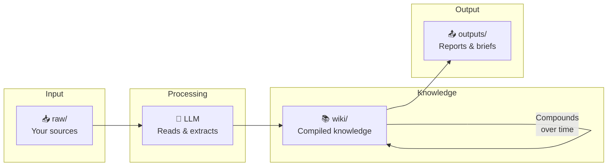

<div align="center">

# 🧠 MeMex — Zero-RAG Personal Knowledge Base

[](https://opensource.org/licenses/MIT)
[](https://github.com/JPeetz/MeMex-Zero-RAG)
[](mcp/)
[](https://github.com/JPeetz/MeMex-Zero-RAG)
[](http://makeapullrequest.com)

**The Karpathy LLM Wiki pattern, production-ready.**

*No embeddings. No vector databases. No infrastructure. Just markdown, git, and your LLM.*

[Quick Start](#quick-start) • [MCP Server](mcp/) • [Prompts](PROMPTS.md) • [Schema](SCHEMA.md) • [Examples](examples/)

</div>

---

> *"The human's job is to curate sources, direct the analysis, ask good questions, and think about what it all means. The LLM's job is everything else."*
> — Andrej Karpathy

Based on [Karpathy's LLM Wiki pattern](https://gist.github.com/karpathy/442a6bf555914893e9891c11519de94f), extended with:
- 🚫 Zero hallucination enforcement — every claim must cite a source
- 🤖 MCP server — expose your wiki to Claude Code, Codex, OpenClaw, Cursor
- 👥 Multi-agent support — multiple AI agents, one shared wiki, git handles conflicts
- 🔒 Human-in-the-loop conflict resolution — LLM flags contradictions, you decide truth
- 📊 Confidence tracking — per-claim certainty scores, quarantine mode for low-confidence pages

## Why Not RAG?

Traditional RAG retrieves document chunks every query. Your LLM rediscovers knowledge from scratch. Every. Single. Time. Nothing compounds.

**MeMex compiles knowledge once.** Your LLM reads your sources and builds a structured, interlinked wiki. Every new source makes the whole wiki richer. Knowledge grows — it doesn't reset.

```
RAG:   Source → [retrieve] → LLM → Answer    (rediscovers every time)
MeMex: Source → [compile]  → Wiki → LLM       (compounds over time)
```



## Key Principles

| Principle | What it means |
|-----------|---------------|
| **LLM-agnostic** | Works with Claude, GPT, Gemini, Llama, Codex — any agent that reads/writes files |
| **Zero infrastructure** | No databases, no embeddings, no servers required. Markdown files + git |
| **Git-native** | Full version history, branching, rollback. Multi-agent via worktrees |
| **Zero hallucination** | Every claim cites a source. Unsourced = error. Lint enforces this on every PR |
| **Human-in-the-loop** | Conflicting sources get flagged and paused — you decide truth, not the LLM |

## Quick Start

### 1. Clone

```bash
git clone https://github.com/JPeetz/MeMex-Zero-RAG.git my-wiki
cd my-wiki
```

### 2. Add a source

Drop any document into `raw/`:
```bash
cp ~/Downloads/interesting-article.md raw/
```

### 3. Tell your LLM to ingest it

Open Claude Code, Cursor, Codex, OpenClaw, or any AI coding agent and paste:

```
Read SCHEMA.md. Then ingest raw/interesting-article.md following the ingest workflow.
```

The LLM will:
- Read the source and discuss key takeaways with you
- Create a summary in `wiki/sources/`
- Create or update entity and concept pages
- Update `wiki/index.md`
- Log the operation in `wiki/log.md`

### 4. Query your knowledge base

```
Read wiki/index.md. Based on the knowledge base, answer: [YOUR QUESTION].
Cite which wiki pages informed your answer.
```

### 5. Run the MCP server (optional)

Expose your wiki to Claude Code, OpenClaw, or any MCP-compatible agent:

```bash
pip install mcp
python mcp/server.py --wiki wiki/

# SSE for remote/multi-agent access
pip install uvicorn starlette sse-starlette
python mcp/server.py --transport sse --port 3001
```

That's it. No setup scripts. No API keys. No database migrations.

## Directory Structure

```
your-wiki/
├── L1/                      # 🔒 Auto-loaded, git-ignored (private)
│   ├── identity.md          # Your preferences, context
│   ├── rules.md             # Hard constraints, gotchas
│   └── credentials.md       # API keys (NEVER committed)
│
├── raw/                     # 📥 Source documents (immutable)
│
├── wiki/                    # 📚 LLM-maintained knowledge base
│   ├── index.md             # Master catalog
│   ├── log.md               # Operation history
│   ├── contradictions.md    # Pending conflict resolutions
│   ├── sources/             # One summary per ingested source
│   ├── entities/            # People, orgs, tools, projects
│   ├── concepts/            # Ideas, frameworks, patterns
│   └── synthesis/           # Analyses, comparisons, insights
│
├── outputs/                 # 📤 Generated reports, slides
├── mcp/                     # 🔌 MCP server (stdio + SSE)
├── scripts/                 # CLI tools (memex ingest/search/lint)
├── SCHEMA.md                # 🧠 The brain — how the wiki works
├── PROMPTS.md               # 📋 Copy-paste prompts for all operations
└── README.md                # This file
```

## The L1/L2 Architecture

Inspired by CPU cache hierarchy:

| Layer | What | Loaded When | Contains |
|-------|------|-------------|----------|
| **L1** | `L1/` directory | Every session (auto-loaded by your agent) | Identity, rules, credentials |
| **L2** | `wiki/` directory | On-demand via queries | Deep knowledge, cross-references |

**L1 is git-ignored.** It contains sensitive context that should never be committed.  
**L2 is the wiki.** Versioned, shareable, grows over time.

## Zero Hallucination Protocol

MeMex enforces citation discipline at every level:

1. **Every claim must have a source**: `[Source: filename.md]`
2. **Lint catches violations**: Unsourced claims are 🔴 ERROR, not warnings
3. **Quarantine mode**: Pages with >20% unsourced claims get `status: quarantine`
4. **GitHub Actions**: Broken links, missing citations, orphan pages checked on every PR

```markdown
✅ Correct:  "Project X uses Redis [Source: architecture.md]"
❌ Rejected: "Project X uses Redis" (no source → lint error)
```

## Conflict Resolution

When sources contradict each other:

1. LLM flags the conflict in `wiki/contradictions.md`
2. LLM stops and asks you which claim is authoritative
3. You decide — the LLM never auto-resolves truth
4. Decision is logged with rationale

## MCP Tools

When running `python mcp/server.py`, your agent gets these tools:

| Tool | Description |
|------|-------------|
| `wiki_search` | BM25 + semantic hybrid search across all pages |
| `wiki_read` | Read a specific page |
| `wiki_list` | List pages by type (entities/concepts/sources/synthesis) |
| `wiki_query` | Natural language query with source attribution |
| `wiki_write` | Write a new page with git attribution (returns commit SHA) |
| `wiki_ingest` | Ingest a raw source into the wiki |
| `wiki_lint` | Run health checks on the wiki |
| `wiki_graph` | Generate wikilink relationship graph |
| `wiki_stats` | Summary statistics |

### Claude Code config (`~/.claude/mcp.json`)

```json
{
  "mcpServers": {
    "memex": {
      "command": "python",
      "args": ["mcp/server.py", "--wiki", "wiki/"]
    }
  }
}
```

### OpenClaw config

```json
{
  "plugins": {
    "mcp": {
      "servers": [{ "name": "memex", "transport": "stdio",
        "command": "python3 mcp/server.py --wiki wiki/" }]
    }
  }
}
```

## Multi-Agent Support

Multiple AI agents can write to the same wiki simultaneously using git worktrees:

```bash
# Each agent gets its own branch/worktree
git worktree add ../wiki-agent-1 feat/agent-1
git worktree add ../wiki-agent-2 feat/agent-2

# Agents commit with attribution
# wiki_write tool commits as: wiki(agent-name): add/update type/slug
```

Git handles authorship, history, and conflict detection natively. See [GUIDE.md](GUIDE.md) for the full multi-agent setup.

## CLI Tooling

```bash
# Add to PATH
export PATH="$PATH:/path/to/memex/scripts"

memex ingest paper.pdf           # PDF with academic metadata
memex ingest https://example.com # Web page
memex search "machine learning"  # BM25 + semantic search
memex lint --fix                 # Check wiki health
memex graph                      # Generate wikilink graph
memex serve                      # Start MCP server
```

## Requirements

- **Any AI coding agent**: Claude Code, Cursor, Codex, OpenClaw, Gemini CLI, etc.
- **Git** for version control
- **Python 3.9+** for MCP server (optional)
- **That's it** — no databases, no APIs, no infrastructure

## Optional Enhancements

| Tool | What it does | When to add |
|------|--------------|-------------|
| [Obsidian](https://obsidian.md) | Graph view, backlinks, visual navigation | From day one |
| [qmd](https://github.com/tobi/qmd) | Local hybrid search for large wikis | 100+ pages |
| [Marp](https://marp.app) | Generate slide decks from wiki content | When presenting |
| [Batch API](mcp/batch.py) | 50% cost reduction for bulk ingests | Large ingest sessions |

## Credits

- [Vannevar Bush](https://en.wikipedia.org/wiki/Memex) — Original Memex concept (1945)
- [Andrej Karpathy](https://gist.github.com/karpathy/442a6bf555914893e9891c11519de94f) — LLM Wiki pattern
- [MehmetGoekce/llm-wiki](https://github.com/MehmetGoekce/llm-wiki) — L1/L2 cache architecture inspiration
- [rohitg00's LLM Wiki v2](https://gist.github.com/rohitg00/2067ab416f7bbe447c1977edaaa681e2) — Lifecycle and consolidation patterns

## Author

[Joerg Peetz](https://github.com/JPeetz) — with contributions from Molty, Coconut, Marvin (AI collaborators on the MeMex team)

## License

MIT — Use it, fork it, adapt it, share it.

---

*Start small. Ingest one source. Ask one question. Watch the wiki grow.*

---

Copyright (c) 2026 Joerg Peetz. All rights reserved.
