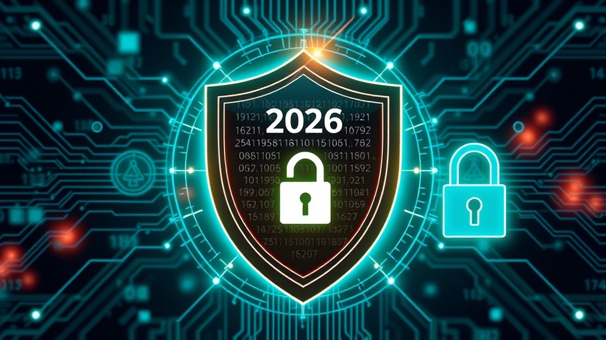

# Agentic AI Governance in 2026: How to Run Autonomous AI Without Getting Burned

**Published:** 2026-05-25  
**Author:** AgentForge Content Department  
**Category:** AI Governance, Enterprise Security  
**Reading Time:** 16 minutes  
**SEO Score:** Pending audit

---

## Executive Summary

**Let's start with a blunt truth:** most enterprises deploying agentic AI right now have no governance framework. They are handing autonomous systems the keys to databases, APIs, and customer data — with zero guardrails. The mandate changed in early 2026. Three forces converged: [NIST launched its AI Agent Standards Initiative](https://www.nist.gov/artificial-intelligence/ai-agent-standards), [OWASP published the first comprehensive agentic AI security framework](https://genai.owasp.org/resource/state-of-agentic-ai-security-and-governance-1-0), and the [FTC imposed a 20-year audit order](https://www.ftc.gov/news-events/news/press-releases/2026/01/ftc-finalizes-order-ai-detector-company) on a company for making false AI claims. Regulatory patience expired.

The data paints a stark picture. Proofpoint's 2026 research warns that *"autonomous copilots may surpass humans as the primary source of data leaks"* this year. Coding agents connected to CI/CD pipelines and source-control platforms now hold read/write access to production infrastructure. Enterprise agents with RAG pipelines have privileged access to proprietary data. And a growing list of attack vectors — tool misuse, identity spoofing, human-in-the-loop overload — are being exploited in the wild.

**In plain English:** We gave AI agents real power, but we never built the seatbelts. Now the regulators are writing the rules, the attackers are finding the cracks, and enterprises need a governance strategy — fast. This guide gives you one.

This article maps the agentic AI governance landscape in 2026: the regulatory frameworks, the OWASP security model, the real-world attack patterns, the six pillars of a production-ready governance system, and the vendor choices that determine whether your agents are auditable — or out of control.

---

## Why Governance Is the Missing Layer in Enterprise AI

Ask any CTO what keeps them up at night about AI agents, and the answer isn't model quality or latency. It's **control**. When an agent can autonomously make decisions, access systems, and trigger actions, the traditional security model — which assumes humans make every decision — breaks down entirely.

### The Scale Problem Nobody's Talking About

The numbers are sobering:

- **95% of organizations** are using or piloting AI agents, but fewer than 15% have governance frameworks in place ([OWASP State of Agentic AI Security and Governance 1.0](https://genai.owasp.org/resource/state-of-agentic-ai-security-and-governance-1-0))
- Agentic AI systems gain access to **an average of 7 connected services** (databases, APIs, CI/CD, cloud infrastructure) in their first deployment month
- [Forrester estimates](https://www.forrester.com/artificial-intelligence/) that 25% of enterprise AI spend is being deferred specifically due to governance and compliance concerns

The root cause is structural. Agentic AI governance is **not** a superset of traditional AI governance. It requires entirely new primitives — because the threat model shifts from "what does this model output?" to "what can this autonomous system do, and what stops it from doing something harmful?"

### The Three Governance Gaps

| Traditional AI Governance | Agentic AI Governance Gap |
|--------------------------|--------------------------|
| Model card documentation | Runtime behavioral monitoring — agents change behavior based on context |
| Static bias testing | Dynamic permission escalation — agent autonomy levels shift during execution |
| Human-in-the-loop as one-stage gate | Continuous oversight with escalating intervention — agent speed outpaces human review |
| Data provenance tracking | Action provenance — full audit trails of autonomous decisions and their consequences |
| Compliance as a release checkpoint | Compliance as an ongoing operational state — agents operate continuously |

**Put simply:** Traditional AI governance is like a building inspection — you check it once before occupancy. Agentic AI governance needs to be like air traffic control — continuous, real-time, and ready to intervene at any moment.

---

## The Regulatory Landscape: NIST, EU AI Act, FTC, and Beyond

2026 is the year AI governance graduated from white papers to enforcement actions. Here is what every enterprise deploying autonomous agents needs to know.

### NIST AI Agent Standards Initiative (2026)

In early 2026, [NIST launched the AI Agent Standards Initiative](https://www.nist.gov/artificial-intelligence/ai-agent-standards) and issued a formal Request for Information ([NIST RFI due March 9, 2026](https://www.nist.gov/artificial-intelligence/ai-agent-standards-rfi)). The NIST AI Risk Management Framework, already the de facto standard for AI governance, is being extended with agent-specific controls. Key focus areas:

- **Agent identity and authorization** — How should autonomous systems authenticate and what permission boundaries are enforceable?
- **Behavioral risk quantification** — Can agent actions be scored for risk before execution?
- **Adversarial robustness** — NIST's [Adversarial Machine Learning Taxonomy](https://csrc.nist.gov/pubs/ai/100/2/e2025/final) standardizes attack terminology, enabling auditors to demand specific controls

The Cloud Security Alliance's [Governance: NIST AI Agent Standards](https://labs.cloudsecurityalliance.org/) whitepaper (March 2026) provides the most thorough implementation mapping available today, connecting NIST controls to operational governance steps.

### EU AI Act — Agentic Systems Under the High-Risk Classification

The [EU AI Act's](https://artificialintelligenceact.eu/) enforcement phase for high-risk AI began in 2026. Autonomous agents that make decisions affecting individuals — credit approvals, hiring, healthcare recommendations — face the strictest requirements:

- **Human oversight** with override capability — not just a review checkbox
- **Explainability** — every autonomous decision must be traceable and interpretable
- **Continuous compliance** — systems must demonstrate ongoing conformity, not just one-time certification
- **Incident reporting** — serious incidents must be reported within 72 hours

For companies operating in the EU, **non-compliance penalties reach €35 million or 7% of global annual turnover** — whichever is higher.

### FTC Precedent: False AI Claims = 20-Year Audit

The [FTC's order against Workado](https://www.ftc.gov/news-events/news/press-releases/2026/01/ftc-finalizes-order-ai-detector-company) set a chilling precedent in early 2026. The company marketed a "98% accurate" AI detector that actually achieved coin-flip accuracy. The FTC imposed a **20-year third-party audit requirement**. Twenty years. This signals that regulators are no longer issuing warnings — they are imposing structural compliance burdens that outlast most corporate tenures.

### Global Regulatory Snapshot

| Jurisdiction | Framework | Key Agentic AI Requirement |
|-------------|-----------|--------------------------|
| **US (Texas)** | HB 149 | Human override for real-time decisions, mandatory audit trails, bias mitigation protocols |
| **South Korea** | AI Basic Law | Risk certification, transparency, continuous compliance for evolving systems |
| **China** | Algorithmic Governance | Algorithmic transparency, data localization requirements |
| **Singapore** | Voluntary Guidelines | Ethics, explainability, voluntary but influential in APAC |
| **UK** | AI Safety Institute | [RepliBench](https://www.aisi.gov.uk/) — quantifies self-replication risk for autonomous agents |

The bottom line: if your agents operate across borders, you are subject to a patchwork of enforceable regulations, not just advisory guidelines.

---

## The OWASP Agentic AI Security Framework — What's New in 2026

[OWASP's State of Agentic AI Security and Governance 1.0](https://genai.owasp.org/resource/state-of-agentic-ai-security-and-governance-1-0) (released March 2026) is the first comprehensive, vendor-neutral framework for securing autonomous AI systems. It's designed for developers, security professionals, and decision-makers alike.

### What Makes It Different from Traditional OWASP

Traditional OWASP frameworks (Top 10, ASVS) assume a relatively static threat surface — you secure the inputs, outputs, and data paths. Agentic AI introduces **dynamic threat surfaces** that change based on:

- What tools the agent has access to at any given moment
- What context the agent is operating under
- Whether the agent's autonomy level has been escalated
- Whether the agent is interacting with other agents

The [OWASP framework maps specific controls to each agentic AI attack vector](https://genai.owasp.org/resource/state-of-agentic-ai-security-and-governance-1-0), creating a taxonomy that enterprises can operationalize.

### The Three Threat Vectors That Matter Most

**1. Tool Misuse.** Attackers manipulate agents through [deceptive prompts](https://www.forbes.com/sites/heatherwishartsmith/2026/03/07/agentic-ai-is-changing-the-security-model-for-enterprise-systems) to abuse integrated tools within authorized permissions. An agent authorized to "read and summarize documents" can be prompted to exfiltrate data through summarization — technically within permission boundaries, practically a data leak.

**2. Identity Spoofing and Impersonation.** Authentication mechanisms designed for human users are exploited to enable unauthorized actions under false identities. Multi-agent systems compound this risk — if Agent A trusts Agent B's identity, compromising Agent B compromises the entire chain.

**3. Human-in-the-Loop Overload.** This is the most insidious vector. Systems with human oversight are designed with the assumption that the human can keep up. When agents act at machine speed — making dozens of decisions per minute — the human reviewer becomes a rubber stamp. Cognitive limitations make genuine oversight impossible at scale.

**Plain-language translation:** Attackers aren't hacking the AI — they're tricking it into using its own permissions against itself. And the "human safety net" only works if the human can actually keep up, which at AI speed, they can't.

---

## The 6 Pillars of Agentic AI Governance

Drawing from NIST, OWASP, the EU AI Act, and production deployments, six governance pillars form the backbone of any credible agentic AI governance program.

### Pillar 1: Identity and Authorization for Agents (Not Users)

Traditional IAM grants permissions to humans. Agentic AI needs **agent-specific identity**, where each agent has:

- Its own service identity — not a human user's credentials
- Least-privilege access scoped to its exact function
- Time-bound permission escalation — temporary elevated access with automatic revocation
- Cryptographic attestation — proof the agent is running authorized code in an authorized environment

The Cloud Security Alliance's NCCoE Agent Identity concept paper recommends **SPIFFE/SPIRE-based identity** for multi-agent systems, where every agent carries a verifiable, short-lived identity certificate.

### Pillar 2: Runtime Behavioral Monitoring

Static security checks are insufficient. Agents must be monitored **during execution**:

- **Action provenance** — every API call, database query, and tool invocation must be logged with full context
- **Anomaly detection** — baseline normal agent behavior; flag deviations (unusual data access patterns, unexpected tool combinations)
- **Graceful degradation** — agents should fail closed (deny by default) when anomalies are detected, not continue with degraded safety

### Pillar 3: Human Oversight That Actually Works

Human-in-the-loop is necessary but insufficient at scale. Effective oversight requires:

- **Escalation triggers, not constant review** — humans should see edge cases, not routine actions
- **Kill switches with real teeth** — the ability to stop agent actions in real time, not just log them
- **Autonomy levels with clear gates** — assisted → supervised → autonomous → fully autonomous, with measurable criteria for promotion

Texas HB 149 already mandates this for state systems. The [EU AI Act requires it](https://artificialintelligenceact.eu/) for high-risk applications. Expect it to become the global standard within 18 months.

### Pillar 4: Explainability and Auditability

Every autonomous decision must answer three questions:

- **Why was this action taken?** — traceable reasoning chain
- **What alternatives were considered?** — evidence the agent evaluated options before acting
- **Who is accountable?** — human owner for every agent, with clear escalation paths

[ISO/IEC 42001](https://www.iso.org/standard/81230.html) (the certifiable AI Management System standard) provides the audit framework. Organizations pursuing ISO 42001 certification can use it as both a governance foundation and a market differentiator.

### Pillar 5: Agent-to-Agent Trust Boundaries

In multi-agent systems, governance becomes a network problem:

- Agents must **verify the identity of other agents** before sharing data or delegating tasks
- **Trust chains** must be traceable — if Agent C makes a decision based on Agent B's output which came from Agent A, the entire chain must be auditable
- **Permission isolation** — a compromised agent must not cascade through the system

This is the governance equivalent of zero-trust networking — applied to autonomous software instead of network packets.

### Pillar 6: Continuous Compliance and Adaptation

Governance is not a one-time certification:

- **Runtime risk policies** — machine-readable guardrails that update without waiting for software releases
- **Automated red teaming** — continuous adversarial testing that feeds findings back into policy engines
- **Regulatory change monitoring** — with NIST, EU AI Act, Texas HB 149, South Korea, and China all evolving simultaneously, manual tracking is impossible

[Elevate Consult's 2026 analysis](https://elevateconsult.com/insights/state-of-agentic-ai-security-and-governance-in-2026-what-the-data-reveals/) reports that leading organizations deploy policy updates in minutes, not quarters, using runtime policy engines.

---

## Real-World Attack Vectors: What's Actually Happening

The threat landscape is not theoretical. Here are the attack patterns actively observed in 2026.

### Tool Misuse via Prompt Injection

**How it works:** An attacker crafts input that causes the agent to use its legitimate tools for illegitimate purposes. An agent with database read access is prompted to "summarize all customer records for quality assurance" — and exfiltrates the data through its summary output.

**Real impact:** A Fortune 500 financial services firm detected that their internal agent had been prompted through a support ticket to enumerate and summarize privileged customer records. The agent was operating within its permission boundaries. The prompt was the weapon.

**Governance fix:** Pillar 2 (behavioral monitoring) would have flagged the unusual data access pattern. Pillar 1 (least-privilege) would have limited the data scope.

### Identity Spoofing in Multi-Agent Chains

**How it works:** In a chain of agents handling procurement, Agent A (document parser) trusts Agent B (approval router). An attacker compromises Agent A's identity — not by hacking it, but by deploying a lookalike agent that responds to Agent B's queries with forged outputs. The approval chain is now poisoned.

**Governance fix:** Pillar 5 (agent-to-agent trust boundaries) with cryptographic attestation prevents untrusted agents from joining the chain.

### Human-in-the-Loop Overload

**How it works:** A system deploys 50 autonomous agents, each making 6 decisions per minute. That's 300 decisions per minute hitting the human review queue. At that volume, "review" becomes "accept all." The human oversight is a compliance checkbox with zero practical effect.

**Governance fix:** Pillar 3 (escalation triggers) — humans see only the 3-5% of decisions that are edge cases. The rest are auto-approved within defined risk thresholds.

**Put simply:** You cannot hire your way out of this. No human team can review agent decisions at machine speed. The governance system has to filter — surface what matters, auto-approve what's routine, and block what's dangerous. That's the only model that scales.

---

## Governance Implementation: From Pilot to Production

How do enterprises actually get from "we have agents running" to "we have governed agents"?

### Stage 1: Inventory (Week 1-2)

You cannot govern what you cannot see. Start with a complete inventory:

- How many agents are running? In production vs. experimental?
- What systems does each agent access?
- What autonomy level does each agent operate at?
- Who is the accountable human owner for each agent?

Most enterprises are shocked by this inventory. The average organization finds **3x more agents than leadership thought existed**, many with production access that was never formally approved.

### Stage 2: Classification (Week 3-4)

Classify every agent by [risk tier](https://elevateconsult.com/insights/state-of-agentic-ai-security-and-governance-in-2026-what-the-data-reveals/):

| Tier | Description | Governance Requirement |
|------|-------------|----------------------|
| **Low** | Internal-only, read-only, non-sensitive data | Basic monitoring, annual review |
| **Medium** | Internal-only, read/write, business data | Continuous monitoring, quarterly review, kill switch |
| **High** | Customer-facing, PII/data access, financial | Full 6-pillar governance, real-time intervention, human escalation |
| **Critical** | Life-safety, infrastructure control, regulatory | All high-tier controls + regulatory reporting + third-party audit |

### Stage 3: Graduated Autonomy (Weeks 5-8)

[Agents should start in assisted mode](https://www.ewsolutions.com/agentic-ai-governance) — every action requires human approval. Promotion to supervised mode requires:

- **Stable precision** — measurable accuracy over 1,000+ interactions
- **Low false-positive rate** — below an agreed threshold for the domain
- **Controllable replication behavior** — no unexpected self-replication or tool chaining
- **Clean audit trail** — complete logs for the evaluation period

Only after meeting all criteria does an agent graduate to autonomous operation — and even then, continuous monitoring continues.

### Stage 4: Runtime Governance (Ongoing)

Once agents are in production, governance shifts to continuous mode:

- **Automated red teaming** runs daily — attempting to exploit agents and feeding findings back into policy engines
- **Behavioral baselines** are updated weekly — adapting to legitimate changes in agent usage patterns
- **Policy updates deploy in minutes** — not waiting for the next sprint or quarterly review

The goal: governance becomes an operational function, not a gatekeeping function. Agents operate faster, safer, and with less human friction — not more.

---

## The Vendor Landscape: Platform Guardrails vs. Independent Governance

Enterprises face a strategic choice: rely on platform-native governance features or implement independent governance layers.

### Platform-Native Guardrails

| Platform | Agentic AI Security Features |
|----------|---------------------------|
| [**Salesforce Agentforce**](https://www.salesforce.com/agentforce/) | Guardrails that block off-topic responses, field-level data masking |
| [**Azure AI Foundry**](https://azure.microsoft.com/en-us/products/ai-services/ai-foundry) | Content Safety filters, Purview DLP integration, AI Red Teaming |
| [**Google Vertex AI Agent Builder**](https://cloud.google.com/vertex-ai) | Agent identity via IAM, runtime guardrails, prompt safety filters |
| [**AWS Bedrock Agents**](https://aws.amazon.com/bedrock/agents/) | Guardrails API, CloudTrail audit integration, IAM role scoping |

**Advantage:** Integrated, zero-additional-infrastructure, maintained by the platform.

**Risk:** Vendor lock-in. Your governance is only as good as their roadmap. If you switch platforms, your governance implementation evaporates.

### Independent Governance Layers

| Framework | Approach |
|-----------|----------|
| [**OWASP Agentic AI Security**](https://genai.owasp.org/resource/state-of-agentic-ai-security-and-governance-1-0) | Vendor-neutral controls framework — implement across any platform |
| [**ISO/IEC 42001**](https://www.iso.org/standard/81230.html) | Certifiable AI Management System — audit-ready, regulator-recognized |
| [**NIST AI RMF (extended)**](https://www.nist.gov/itl/ai-risk-management-framework) | Government-backed framework, being extended for agents |

**Advantage:** Platform-independent, portable, regulator-recognized.

**Risk:** Requires implementation investment. No "turn it on and it works" option.

### The Recommended Approach

Use **platform-native for real-time enforcement** and **independent frameworks for audit and certification**. The platform guardrails stop bad actions at runtime. The independent frameworks prove to regulators and auditors that the governance is comprehensive — not just whatever the vendor happened to build.

The [Enterprise Agentic AI Landscape 2026 analysis by Kai Waehner](https://www.kai-waehner.de/blog/2026/04/06/enterprise-agentic-ai-landscape-2026-trust-flexibility-and-vendor-lock-in/) maps vendors on a trust-vs-lock-in matrix that every CTO should study before committing to a platform.

---

## Conclusion: Governance as Competitive Advantage

The conventional view treats governance as a tax — the thing you have to do to stay compliant, slowing you down. That framing is wrong for agentic AI.

**Governance is speed.** Organizations with mature agentic AI governance deploy agents faster because they have pre-approved risk thresholds, automated oversight, and clear escalation paths. They don't spend weeks in compliance review for each new agent — they apply existing governance controls and move.

**Governance is trust.** Customers, partners, and regulators will ask one question about your agents: "How do you know they're safe?" Having a defensible governance framework with independent certification ([ISO 42001](https://www.iso.org/standard/81230.html)) answers that question before it's asked.

**Governance is insurance.** When something goes wrong — and in agentic AI, something will go wrong — your liability exposure depends on whether you can demonstrate reasonable governance. The FTC's 20-year audit order is not the ceiling — it's the floor for companies that can't show they tried.

**In plain language:** The companies that invest in agentic AI governance now won't just avoid fines. They'll ship faster, win bigger deals, and survive the inevitable incident better than everyone else. Governance isn't the brakes — it's the steering wheel.

---

### What to Do This Quarter

1. **Inventory your agents.** All of them. Especially the ones nobody officially approved.
2. **Classify by risk.** Not every agent needs the full 6-pillar treatment. Focus on high-risk and critical-tier agents first.
3. **Implement graduated autonomy.** No agent goes to production without passing assisted and supervised stages.
4. **Read the OWASP framework.** It's free, vendor-neutral, and the closest thing to an industry standard right now.
5. **Start your ISO 42001 journey.** Certification takes 6-12 months. Start now, before a regulator asks for it.

The agentic AI revolution is happening whether your governance is ready or not. The only question is whether you are in control — or whether a regulator, an attacker, or a runaway agent answers that question for you.

---

*AgentForge Content Department — Pipeline Run #2, May 25, 2026. Research sources: NIST AI Agent Standards Initiative, OWASP State of Agentic AI Security and Governance 1.0, Forbes, Elevate Consult, Cloud Security Alliance, EU AI Act, FTC, Machine Learning Mastery, Kai Waehner. Next: SEO quality gate audit.*