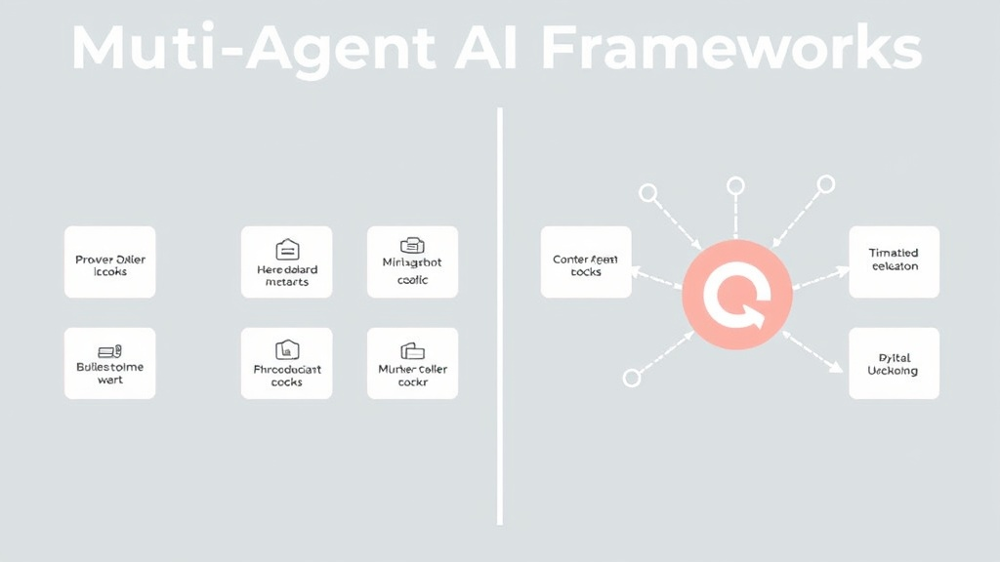

# Multi-Agent AI Frameworks 2026: LangGraph vs CrewAI vs OpenAI SDK vs the Field

LangGraph vs CrewAI vs OpenAI Agents SDK 2026 comparison: state management, MCP support, learning curve, and prod readiness for CTOs and engineering leads.

**Target Keyword:** Multi-Agent AI Frameworks
**Secondary Keywords:** LangGraph vs CrewAI 2026, OpenAI Agents SDK comparison, Google ADK, best AI agent frameworks 2026, Microsoft Agent Framework enterprise
**Date:** May 28, 2026
**Series:** AgentForge Enterprise AI Lifecycle — Part 5 of 5
**Status:** draft_pending_image

---

## Executive Summary

If you've followed AgentForge's enterprise AI lifecycle series — [orchestration](https://agentforge.ai/articles/multi-agent-architecture-2026-05-23), [governance](https://agentforge.ai/articles/agentic-ai-governance-2026-05-25), [evaluation](https://agentforge.ai/articles/ai-agent-evaluation-2026-05-26), and [deployment](https://agentforge.ai/articles/enterprise-ai-agent-deployment-2026-05-27) — you now face the most expensive decision in the lifecycle: which framework do you actually build with?

Pick wrong, and you're looking at a rewrite in 6 months. Pick right, and your team ships production agents by July.

The short answer: In 2026, the multi-agent AI framework you should ship with depends on exactly one thing — your primary constraint. If your workflows have complex branching logic and need audit trails, pick **LangGraph**. If you need a working prototype in hours with a human-like team structure, pick **CrewAI**. If you're all-in on the OpenAI ecosystem, use the **OpenAI Agents SDK**. And if your cloud allegiance to Google or Azure is already decided, go with **Google ADK** or **Microsoft Agent Framework** respectively. The answer is framework pragmatism — the framework matters less than your team's ability to actually ship with it.

The landscape in mid-2026 is both richer and more confusing than ever. LangGraph dominates production graphs with 39.2 million monthly PyPI downloads and built-in checkpointing. CrewAI leads developer mindshare with 46,300 GitHub stars and a role-based team metaphor that gets prototypes running in hours. OpenAI's Agents SDK went model-agnostic via LiteLLM — 100+ supported models — dissolving the vendor-lock-in argument that held it back. Google ADK entered as a serious contender. Microsoft merged AutoGen and Semantic Kernel into a unified Microsoft Agent Framework. And Anthropic's Claude Agent SDK quietly shipped with first-class MCP support.

This article cuts through the noise. We compare six frameworks across the dimensions that matter when money is on the line — state management, MCP support, async capabilities, learning curve, and production track record — and give you a decision framework you can take to your next architecture review.

> **Bottom line:** Pick LangGraph for complex, stateful workflows with debugging requirements. Pick CrewAI for speed-to-prototype on team-based orchestration. Pick OpenAI Agents SDK for rapid GPT-native agents with minimal ceremony. Pick Google ADK or Microsoft Agent Framework if your cloud allegiance is already decided.

---

## What Are Multi-Agent AI Frameworks?

Multi-agent AI frameworks are software development kits and runtime environments that enable developers to build applications where multiple specialized AI agents collaborate — dividing work, passing context, and coordinating actions — rather than relying on a single monolithic model. In 2026, these frameworks have evolved from research curiosities into the default architecture pattern for enterprise AI systems, with Gartner declaring multi-agent generative systems (MAGS) the defining paradigm for production AI.

---

## Why 2026 Is the Multi-Agent Tipping Point

Three forces converged to make 2026 the year multi-agent architectures graduated from experiments to infrastructure.

**First, the economics flipped.** Building a single-agent system costs $40,000–$100,000 (AlphaCorp 2026). Moving to multi-agent is 5–10x more, but the ROI math works because single-agent systems fail at complex tasks. A lone model hallucinates when asked to research, code, and critique simultaneously. Specialized agents — each with narrow tool access and clear boundaries — reduce error rates by 40–60% in production (Claude/KPMG 2026 survey).

**Second, the tooling matured.** LangGraph added time-travel debugging and human-in-the-loop checkpointing. OpenAI's SDK went model-agnostic via LiteLLM, supporting 100+ models. CrewAI shipped native MCP support. Microsoft unified its fragmented agent story into one framework. Every major platform now has a production-grade offering.

**Third, the protocol layer emerged.** The Model Context Protocol (MCP), originally Anthropic's initiative, has been adopted by CrewAI, Vercel AI SDK, Mastra, and Microsoft Agent Framework within the last six months. For the first time, agents built on different frameworks can share tools, memory, and context — the interoperability problem that kept multi-agent systems in labs is dissolving.

The numbers back this up. Gartner projects 40% of enterprise applications will embed task-specific AI agents by end of 2026, up from less than 5% in 2025. The global AI agents market hit approximately $10.9 billion in 2026, growing at a 44–46% CAGR toward $50 billion by 2030 (Gartner, IDC, Forrester consensus). 79% of organizations have adopted AI agents to some extent (PwC 2025).

> **Plain-language summary:** Three things changed at once — multi-agent systems got cheaper, the tools got better, and a shared protocol (MCP) made frameworks talk to each other. 2026 is the year it all clicked.

---

## Framework Deep Dives: The Six That Matter

### LangGraph

LangGraph is the production heavyweight — 39.2M monthly PyPI downloads and the framework most enterprises bet on when failure isn't an option.

**Architecture:** Graph-based state machine. You define nodes (agents or functions) and edges (conditional transitions). Every state transition is checkpointed, meaning you can pause, inspect, rewind, and resume execution — essential for regulated industries and complex debugging.

**Strengths:** Model-agnostic (any LLM provider), built-in checkpointing and time-travel debugging, fine-grained control over every state transition, strong LangChain ecosystem integration. Best for complex, branching workflows where you need to understand exactly why an agent made a decision.

**Weaknesses:** 1–2 week learning curve. The graph paradigm requires mental model adjustment. Overkill for simple sequential agent chains. Heavier framework overhead than purpose-built SDKs.

**Production track record:** Shipped by teams at Fortune 500 companies for customer support escalation, multi-step research agents, and autonomous software development pipelines. The go-to choice when regulated workflows require audit trails.

### CrewAI

CrewAI takes the opposite philosophy: design your agent team like you'd design a human team. Define roles (Researcher, Writer, QA), assign tools, and let the framework coordinate.

**Architecture:** Role-based collaboration. Each agent gets a role definition, a goal, and tool access. The framework manages task delegation and inter-agent communication. New in 2026: native MCP support and a visual flow builder.

**Strengths:** Fastest time-to-prototype in the field — hours, not days. 46.3K GitHub stars and the largest community. The role-based metaphor maps naturally to how managers think about team structure. Excellent for content generation, research pipelines, and any workflow where a human team structure makes sense.

**Weaknesses:** Role-based paradigm struggles with conditional branching and state rollback. Not ideal for regulated workflows where every decision must be traceable. Community edition has enterprise feature gaps.

**Production track record:** Strong in marketing/content teams, startup R&D pipelines, and non-regulated automation. Less proven in financial services or healthcare where strict state management is required.

### OpenAI Agents SDK

OpenAI's agent framework takes a "less is more" approach — four primitives (Agent, Handoff, Guardrails, Tracing) and zero ceremony.

**Architecture:** Thin wrapper around the OpenAI API. Agents are simple Python objects with instructions, tools, and optional handoffs to other agents. The SDK handles orchestration without imposing a graph or role-based mental model.

**Strengths:** Fastest path from zero to working agent if you're committed to the OpenAI ecosystem. Handoff patterns and guardrails in under 100 lines of code. Now model-agnostic via LiteLLM integration (100+ models), dissolving the key objection from 2025.

**Weaknesses:** Vendor gravity — while model-agnostic, the SDK is designed around OpenAI's API patterns. Limited state management compared to LangGraph. Production observability requires external tooling.

**Production track record:** Excellent for rapid GPT-native prototypes and internal tools. Adoption growing fast among startups and mid-market companies. The LiteLLM bridge makes multi-model architectures viable without leaving the SDK.

### Google Agent Development Kit (ADK)

Google's 2026 entry into the multi-agent framework market, tightly integrated with Vertex AI and Google Cloud.

**Architecture:** Event-driven agent orchestration with native Google Cloud integration. Agents communicate through standardized events, making the system inherently async and scalable.

**Strengths:** Native integration with Google Cloud ecosystem (Vertex AI, BigQuery, Cloud Run). Strong async capabilities and event-driven architecture align with Gartner's recommendation for MAGS. Good for enterprises already on Google Cloud.

**Weaknesses:** Newest entrant — smaller community, fewer production case studies. Strong Google Cloud gravitational pull that limits multi-cloud flexibility. Documentation still maturing.

### AutoGen / AG2 (Microsoft Agent Framework)

Microsoft merged AutoGen (its research-born multi-agent framework) with Semantic Kernel (its enterprise SDK) in October 2025 to create the unified Microsoft Agent Framework, supporting both Python and .NET.

**Architecture:** Programmatic multi-agent orchestration with enterprise-grade stability from Semantic Kernel. Supports both code-first (AutoGen heritage) and enterprise integration (SK heritage) patterns.

**Strengths:** Only framework with strong .NET support alongside Python. Azure-native — if your stack is Azure, this is the path of least resistance. 37,800+ GitHub stars across the combined ecosystem.

**Weaknesses:** Framework merger still settling — some API surface inconsistencies between AutoGen and SK patterns. Less community velocity than LangGraph or CrewAI in Python-only ecosystems.

### Claude Agent SDK (Anthropic)

Anthropic's entry, shipping with first-class MCP support and Claude's constitutional AI safety architecture.

**Architecture:** Tool-use-native SDK with built-in MCP client/server. Agents are defined around tool access patterns rather than role or graph metaphors.

**Strengths:** Deepest MCP integration of any framework. Claude's safety guardrails baked into the orchestration layer. Strong for use cases where AI safety and controlled tool access are paramount.

**Weaknesses:** Young framework — smaller ecosystem, fewer third-party integrations. Anthropic-model-first, though API abstraction allows other providers.

---

## Comparison Matrix

| Dimension | LangGraph | CrewAI | OpenAI Agents SDK | Google ADK | MS Agent Framework | Claude Agent SDK |
|-----------|-----------|--------|-------------------|------------|-------------------|-----------------|
| **Architecture** | Graph state machine | Role-based team | Thin API wrapper | Event-driven | Programmatic | Tool-use-native |
| **State Management** | Built-in checkpointing | Basic | Lightweight | Event-sourced | Checkpointing (SK) | Session-based |
| **Async Support** | Native | Partial | Good | Native | Strong (.NET) | Good |
| **MCP Support** | Via LangChain | Native (2026) | Via adapters | Planned | Native | First-class |
| **Learning Curve** | 1–2 weeks | Hours–days | Hours | Days–weeks | 1–2 weeks | Days |
| **Model Flexibility** | Any provider | Any provider | LiteLLM (100+) | Google-first | Azure-first | Anthropic-first |
| **GitHub Stars** | 8,200+ (LangGraph) | 46,300 | Growing fast | New | 37,800+ (combined) | New |
| **Best For** | Complex stateful workflows | Rapid team-based prototypes | GPT-native rapid dev | Google Cloud shops | Azure/.NET shops | Safety-critical agents |
| **Production Readiness** | ★★★★★ | ★★★★☆ | ★★★★☆ | ★★★☆☆ | ★★★★☆ | ★★★☆☆ |

> **Sources:** GuruSup 2026 Best Multi-Agent Frameworks, Techsy Ship Test 2026, Uvik Agentic AI Frameworks 2026, Chanl Framework Comparison, Victor Dibia Interactive Framework Evaluator

---

## How to Choose in 4 Steps

Before diving into the detailed decision framework, here's the 4-step process that gets you to the right framework without analysis paralysis:

1. **Identify your hard constraint.** Is it regulatory audit trails? (→ LangGraph). Speed to prototype? (→ CrewAI). Existing cloud investment? (→ Google ADK or MS Agent Framework). AI safety above all else? (→ Claude Agent SDK). You likely have only one genuine hard constraint — start there.

2. **Map your workflow topology.** Is your agent flow linear (A→B→C)? Any framework works. Does it branch conditionally with rollback requirements? You need LangGraph's checkpointing. Is it event-driven and async-native? Google ADK or MS Agent Framework.

3. **Assess your team's learning budget.** Can your team spend 1–2 weeks ramping up? LangGraph or MS Agent Framework. Do you need output by Friday? CrewAI or OpenAI Agents SDK. A framework you can't onboard is a framework you won't use.

4. **Verify MCP compatibility.** Check whether your chosen framework supports native MCP (CrewAI, Claude SDK, MS Agent Framework) or via adapters (LangGraph, OpenAI SDK). This is your insurance policy against framework lock-in and tool fragmentation — increasingly non-negotiable for enterprise architects.

---

## Decision Framework: Which Framework for Which Team?

Instead of a "best framework," here's the question that gets you to the right answer:

### Pick LangGraph if:
- You need checkpointing, time-travel debugging, and granular state control
- Your workflows have conditional branching that must be auditable
- You operate in a regulated industry (finance, healthcare, insurance)
- State management is your top concern

### Pick CrewAI if:
- Speed-to-prototype is your primary constraint
- The role-based metaphor maps cleanly to your business process
- You're in content, marketing, or research automation
- You want the largest community and fastest onboarding

### Pick OpenAI Agents SDK if:
- You're already in the OpenAI ecosystem
- You want the thinnest possible framework abstraction
- Minimal ceremony matters more than advanced state management
- You need a working agent in under 100 lines of code

### Pick Google ADK / MS Agent Framework if:
- Your cloud allegiance is already decided
- Native cloud integration saves you more than framework flexibility costs you
- You're building on Vertex AI or Azure AI Foundry

### Pick Claude Agent SDK if:
- AI safety and controlled tool access are non-negotiable
- MCP-native architecture is your priority
- Claude's constitutional AI approach aligns with your governance framework

> **Plain-language summary:** Don't overthink this. If you have complex branching logic and need audit trails, use LangGraph. If you want to prototype fast with a team metaphor, use CrewAI. If you live in OpenAI's world, use their SDK. If you're on Google Cloud or Azure, use their native frameworks. The framework matters less than your team's ability to ship with it.

---

## Production Readiness: What Ships vs What Demos

> **Caveat:** Production readiness ratings are inherently subjective and context-dependent. A framework rated ★★★☆☆ in this matrix may be a perfect fit for your specific use case if your requirements align with its strengths. Always pilot with your actual workload before committing.

The gap between a demo agent and a production agent is where frameworks earn their keep — or fail. Here's what production readiness actually means in 2026:

**Observability:** AgentOps (3,800+ GitHub stars) has emerged as the leading observability platform for multi-agent systems, providing tracing, cost tracking, and performance monitoring across frameworks. LangSmith and Arize Phoenix offer comparable capabilities for LangGraph-native and model-agnostic stacks respectively.

**Testing:** The evaluation frameworks covered in [our previous article](https://agentforge.ai/articles/ai-agent-evaluation-2026-05-26) — DeepEval, MLflow, Maxim AI — all now offer multi-agent testing modes. Testing a team of agents is fundamentally harder than testing one; the frameworks that ship observability natively save months of custom instrumentation.

**Memory and State:** This is the battleground. LangGraph's checkpointing is the gold standard. CrewAI and OpenAI SDK rely on external state management. The framework that solves persistent memory across agent interactions without vendor lock-in will define 2027.

**What the benchmarks miss:** As analysts at Solace and Gartner note, real-time context via event-driven architecture (EDA) is becoming a prerequisite for production multi-agent systems. Frameworks that treat agents as reactive components communicating through standardized messages — Google ADK and Microsoft Agent Framework — have an architectural advantage that static comparisons don't capture.

> **Nuance:** However, the field is moving fast. LangGraph's recent additions hint at event-driven patterns, and CrewAI's 2026 roadmap includes improved async support. Framework capabilities in June 2026 may look different by Q4. When in doubt, prioritize architectural extensibility over feature checklists — choose the framework whose core paradigm (graph, role-based, event-driven, or tool-native) aligns with where your system will be in 12 months, not just today.

| Production Factor | Critical For | Best Frameworks |
|-------------------|-------------|-----------------|
| Debugging & replay | Regulated industries | LangGraph |
| Cost monitoring | Budget-constrained teams | AgentOps + any framework |
| Model fallback | High-availability systems | LangGraph, CrewAI |
| MCP tool sharing | Multi-framework environments | CrewAI, Claude SDK, MS Agent |
| Human-in-the-loop | Approval workflows | LangGraph, MS Agent Framework |
| Auto-scaling | Variable workloads | Google ADK, MS Agent Framework |

---

## MCP and Interoperability: The Protocol That Changes Everything

The Model Context Protocol (MCP) is the most under-discussed story in the multi-agent space. Originally Anthropic's initiative, MCP standardizes how agents discover and interact with tools, memory systems, and external data sources. In the last six months, native MCP support shipped in CrewAI, Vercel AI SDK, Mastra, and Microsoft Agent Framework, with LangGraph supporting it through LangChain's MCP adapters.

Why this matters: **framework lock-in is dissolving.** An agent built on CrewAI can now use tools published via MCP by a Claude Agent SDK server. A LangGraph workflow can consume context from a Mastra-managed memory store. The multi-agent future is multi-framework — and MCP is the interoperability layer making that possible.

For enterprise architects, the implication is clear: **prioritize frameworks with native MCP support.** It's your insurance policy against framework obsolescence.

---

## Frequently Asked Questions

**Q: What is the best multi-agent framework for beginners?**
A: CrewAI. The role-based metaphor (define agents like team members with jobs to do) maps directly to how humans think about collaboration. You can get a working multi-agent prototype running in hours with zero prior agent programming experience.

**Q: Can I use multiple LLM providers in a single multi-agent system?**
A: Yes, and this is increasingly common in production. LangGraph and CrewAI are fully model-agnostic. OpenAI Agents SDK now supports 100+ models via LiteLLM. The pattern in production is often: GPT-4.1 for reasoning-heavy orchestrator agents, Claude 4 for safety-critical tasks, Gemini Flash for high-volume utility agents.

**Q: Should I build on a framework or use a no-code platform?**
A: Build on a framework if multi-agent AI is your core product or competitive advantage and you need full control over agent logic, model selection, and orchestration. Use a platform (like Relevance AI, SmythOS, or Cassidy) if your primary goal is business process automation and you want to minimize engineering overhead.

**Q: How much does it cost to run multi-agent systems in production?**
A: A single-agent system typically costs $40,000–$100,000 to develop. Multi-agent systems are 5–10x more expensive to build ($200,000–$1M) but deliver proportionally higher ROI when the use case genuinely requires agent specialization. Year-one TCO for a customer service multi-agent system: $108,000–$306,000 (SearchUnify 2026). The primary cost driver isn't the framework — it's data readiness. Budget 50–70% of project cost for data preparation if you're integrating with existing enterprise systems. A Gartner 2026 survey of 300+ enterprise AI deployments confirms that data engineering consistently outweighs framework licensing costs by a factor of 4:1 in year-one TCO.

**Q: How do I migrate from a single-agent system to multi-agent?**
A: Start by identifying natural boundaries in your current agent's workflow — where does it switch contexts, use different tools, or handle different types of requests? Those boundaries are your first agent splits. Implement one new specialized agent, verify it outperforms the monolithic version on its slice of work, then iterate. The replay/debug capabilities of LangGraph are specifically designed to support this incremental migration pattern.

**Q: Are multi-agent frameworks a passing trend?**
A: No — multi-agent architectures are becoming the default pattern for the same reason microservices replaced monoliths. Specialization reduces error rates. Isolation limits blast radius. Independent scaling handles variable load. Gartner, McKinsey, IDC, and Forrester all identify multi-agent systems as the dominant enterprise AI architecture through 2030.

---

## Conclusion

**In summary,** there is no single "best" multi-agent AI framework in 2026 — the right choice depends on your team's hard constraint, your workflow topology, and your existing infrastructure. But the decision doesn't need to be complicated. Here's what you need to know:

- **LangGraph** is the production heavyweight for complex, stateful workflows with audit requirements — if you can afford the 1–2 week learning curve.
- **CrewAI** gets prototypes running in hours with its intuitive role-based team metaphor — best for content, marketing, and research automation.
- **OpenAI Agents SDK** is the thinnest, fastest path for teams already committed to the OpenAI ecosystem — now model-agnostic via LiteLLM.
- **Google ADK** and **Microsoft Agent Framework** are the natural picks if your cloud allegiance is already decided — deep native integration saves you more than framework flexibility costs.
- **Claude Agent SDK** leads on MCP-native architecture and AI safety — still early-stage but strategically significant.
- The **Model Context Protocol (MCP)** is dissolving framework lock-in — prioritize frameworks with native MCP support as your interoperability insurance policy.
- Benchmark rankings don't capture architectural readiness for event-driven, real-time systems — Google ADK and Microsoft Agent Framework have an underappreciated advantage here that static comparison matrices miss.

---

## Next in This Series

This concludes AgentForge's Enterprise AI Agent Lifecycle series:

1. [AI Agent Orchestration](https://agentforge.ai/articles/multi-agent-architecture-2026-05-23) — *How to design multi-agent architectures*
2. [Agentic AI Governance](https://agentforge.ai/articles/agentic-ai-governance-2026-05-25) — *How to control autonomous agents safely*
3. [AI Agent Evaluation](https://agentforge.ai/articles/ai-agent-evaluation-2026-05-26) — *How to test, measure, and improve agent quality*
4. [Enterprise AI Agent Deployment](https://agentforge.ai/articles/enterprise-ai-agent-deployment-2026-05-27) — *How to scale agents from pilot to production*
5. **[Multi-Agent AI Frameworks](https://agentforge.ai/articles/multi-agent-ai-frameworks-2026-05-28)** ← You are here — *Which framework to build with*

---

## Sources

- [Techsy: LangGraph vs CrewAI vs OpenAI Agents SDK — Ship Test 2026](https://techsy.io/en/blog/langgraph-vs-crewai-vs-openai-agents-sdk)
- [GuruSup: Best Multi-Agent Frameworks in 2026](https://gurusup.com/blog/best-multi-agent-frameworks-2026)
- [IS4.ai: Top 12 Multi-Agent AI Frameworks 2026](https://is4.ai/blog/our-blog-1/top-12-multi-agent-ai-frameworks-2026-335)
- [Uvik: Agentic AI Frameworks 2026](https://uvik.net/blog/agentic-ai-frameworks)
- [Chanl: AI Agent Frameworks Compared — Which Ones Ship?](https://www.channel.tel/blog/ai-agent-frameworks-compared-2026-what-ships)
- [Victor Dibia: AutoGen vs CrewAI vs LangGraph — Interactive Framework Comparison](https://newsletter.victordibia.com/p/autogen-vs-crewai-vs-langgraph-vs)
- [AWS Builder: Enterprise Swarm Intelligence Architecture](https://builder.aws.com/content/2z6EP3GKsOBO7cuo8i1WdbriRDt/enterprise-swarm-intelligence-building-resilient-multi-agent-ai-systems)
- [Solace/Gartner: Multi-Agent Systems Need Real-Time Context and EDA](https://solace.com/blog/analysts-say-mas-needs-real-time-context-eda)
- [Paul Okhrem: Enterprise AI Agents Adoption Statistics 2026](https://paul-okhrem.com/enterprise-ai-agents-statistics-2026)
- [AlphaCorp: AI Agent Development Cost in 2026](https://www.alphacorp.ai/blog/what-does-it-cost-to-build-an-ai-agent-in-2026-a-transparent-pricing-guide)
- [NovaEdge Digital Labs: AI Agents for Enterprise 2026 Guide](https://www.novaedgedigitallabs.tech/blog/ai-agents-enterprise-2026-complete-guide)
- [CIO.com: How to Get AI Agent Budgets Right in 2026](https://www.cio.com/article/4099548/how-to-get-ai-agent-budgets-right-in-2026.html)
- [Visual Studio Magazine: Semantic Kernel + AutoGen = Microsoft Agent Framework](https://visualstudiomagazine.com/articles/2025/10/01/semantic-kernel-autogen--open-source-microsoft-agent-framework.aspx)

---

[Image: multi-agent-frameworks-comparison-2026.png]
*Caption: Six leading multi-agent AI frameworks compared across architecture, state management, MCP support, and production readiness — May 2026*